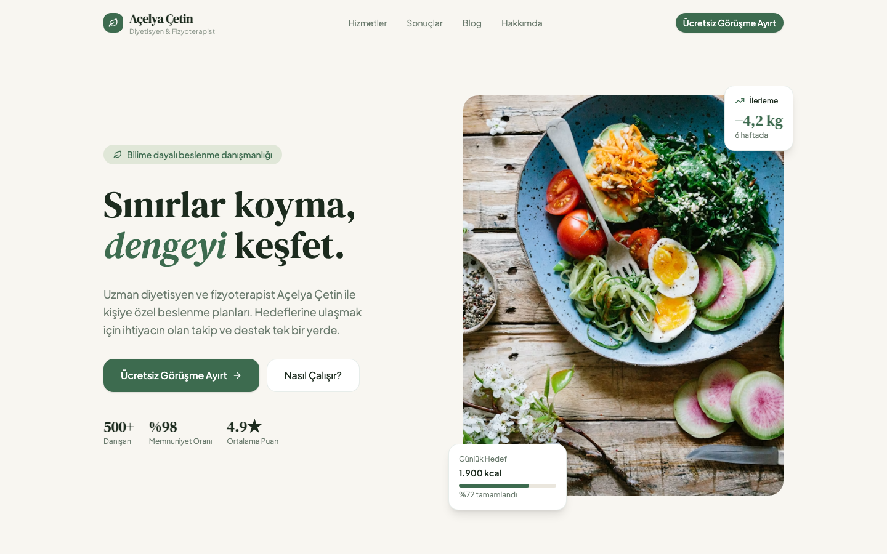

# Açelya Çetin — Diyetisyen & Fizyoterapist Portal

Diyetisyen/fizyoterapist için kişiye özel beslenme danışmanlığı tanıtım ve randevu sitesi. İlerleme takibi, hizmetler ve sonuçlar bölümlerini içeren React uygulaması, FastAPI backend ile birlikte.

## Tech Stack

- Frontend: React + Vite + TypeScript, Tailwind CSS, shadcn/ui
- Backend: `backend/` (FastAPI)
- Altyapı: Terraform ile AWS (EC2, RDS, CloudFront) — `terraform/`

## Proje Hakkında

Freelance müşteri projesi. Figma tasarımından üretilen kod tabanı, backend ve AWS altyapısıyla birlikte bu repoda geliştirilip son haline getirilmiştir.

## Running the code

Run `npm i` to install the dependencies.

Run `npm run dev` to start the development server.
